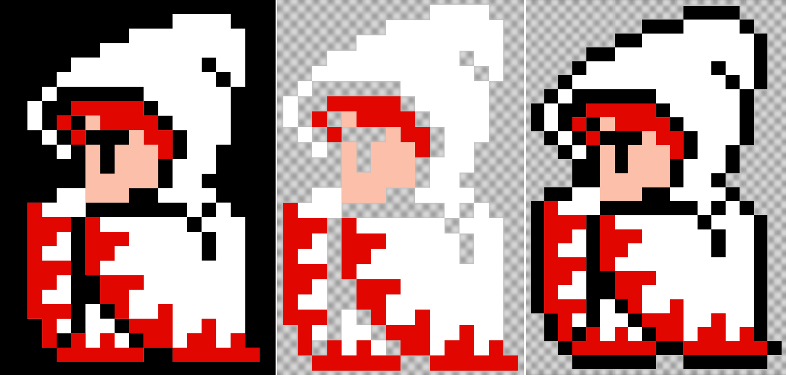

# What Is This?

firaga is a tool to help you plan and build pixel-based arts and crafts. firaga understands common crafting materials and palettes like Perler beads, DMC cross stitch thread, and LEGO building blocks.

Once you've adjusted the image to your liking, try printing an actual-size guide, or use the "Symbols & Spans" mode for an easy-to-follow on-screen chart.

Note: this is not for *drawing* pixel-based art. For that, you can try tools like [pixilart](https://www.pixilart.com/) or [lospec](https://lospec.com/pixel-editor/).

# Settings

## Material

Material settings controls what sort of colors and grid you'll be using.

### Color Matching

Unless *Palette* is set to *All Colors*, firaga uses a color-matching algorithm to select a set of bead colors that best matches the input image.

There are three available color matching algorithms. It's hard to predict which will work best in any given image, so try switching this around if you don't like the results.

 * **[ICtCp](https://en.wikipedia.org/wiki/ICtCp)** is a perceptual color matching algorithm based on technology developed for televisions. It's a good all-around choice and does particularly well on flesh tones.
 * **[CIEDE2000](https://en.wikipedia.org/wiki/Color_difference#CIEDE2000)** is another perceptual color matcher that generates good results for most images.
 * **RGB** uses a naive sum-of-squares calculation on a per-color-channel basis. For some combinations of input images and available palettes, this can generate better results.

There are also two additional options:
 * The **No Duplicates** setting forces the algorithm to choose a different output bead for every different image color, if possible. This can be beneficial when, for example, it's more important to establish a color gradient for shading purposes than to have exact color accuracy. The built-in "Kirby" image, when using a smaller set of available bead colors, is a situation where you'd probably want to check this box.
 * **Improve Black/White** enhances the contrast of unsaturated colors. This makes it more likely that things we'd consider "black" get assigned to the true black color of our crafting palettes.

### Palette

Choose the palette based on the crafting materials you intend to use, or "All Colors" to keep the original image's colors as-is.

### Grid Size

firaga can generate "actual size" printouts, which are especially helpful for putting underneath transparent fuse bead pegboards.

#### For Fuse Beads

firaga supports Artkal Mini, Perler Mini, Evoretro, and Funzbo pegboard sizes. **You must select this based on the pegboard, not the bead** -- while Perler and Artkal beads are interchangeable, they use slightly different spacings between pegboard pegs. If your printout is slightly off, verify your pegboard size and try again. If you're unsure which pegboard you have, the shopping links take you to Amazon product pages where you can figure out which model you have.

When this size is selected, the "Auto" Grid option will show a major grid corresponding to the size of each pegboard.

#### For Cross-Stitch

Select **16 ct** or **30 ct** for 16 threads per inch or 30 threads per inch, respectively.

When this size is selected, the "Auto" Grid option will show a major grid corresponding to one inch.

#### LEGO

The **LEGO** corresponds to a stud-facing view of a LEGO brick.

Note: LEGO bricks seen from the side do not form squares, and firaga doesn't directly support non-square imaging.

## Image Settings

### Transparency

Assuming you've already cleaned up a sprite by putting it on a uniform background, firaga can simplify the plan by dropping pixels that should be ignored. You can change how this process works if needed.

 * **Auto**: Determine transparency automatically
 * **Alpha Channel**: Only drop pixels with zero opacity in the input image
 * **Magenta**: Only drop true magenta (#FF00FF) pixels
 * **Corners**: Use the corner pixels of the image to infer the background color
 * **None**: Do not drop any pixels

The **Keep Outline** will keep a single-pixel border of background around the image. This is most useful for sprites on a black background which would normally be outlined in black:

"White Mage" shown with None, Auto, Auto + Keep Outline settings.

### Color Adjust

You can tweak the image before the paletting algorithm runs. This option is not available in certain Apple devices due to a lack of support for CSS filters in Canvas contexts.

### Dithering

**[Dithering](https://en.wikipedia.org/wiki/Dither)** is a process for reducing the number of colors in an image while reducing banding artifacts. This is useful for photographic inputs.

 * **Auto**: Dither when there are more than 256 colors in the source image
 * **On**: Always dither
 * **Off**: Don't dither

Photographic image showing dithering off and on, using limited "Evoretro" palette.

### Transforms

You can apply various transforms to the image. This is useful if you want to use an ironing method where the front of the artwork becomes the back. Note that combining **Flip** and **Mirror** does not result in a "reversed" image.

 * **Flip**: Reverse the image about the Y-axis
 * **Mirror**: Reverse the image about the X-axis
 * **Undo Upscaling**: Automatically undo any pixel-perfect 2x, 3x, or 4x scaling

## Plan Settings

Once the image has been processed, you'll see a "Plan" in the center of the screen. You can change how the plan is displayed.

### Legend

You can overlay symbols over each pixel in the plan to aid in determining which color bead to use.

 * **Symbols + Spans**: Shows a condensed legend where runs of more than 2 pixels are notated as e.g. "A x 3" using their symbol from the Legend
 * **Spans**: Only show the length of each run of color
 * **Symbols**: Show the corresponding symbol from the Legend on each pixel
 * **None**: Don't overlay any symbols

### Grid

You can select a grid overlay. The **Auto** option will size the grid based on the **Material -> Size** setting.

**Nudge Grid** adjusts the origin point of the major gridlines so that the smallest number of major grid areas are occupied.

### Reference Object

To help visualize the size of a completed object, you can select an everyday object to overlay on the plan.

# Identifying Your Pegboard

What's the old pegboard you found? This is a list *transparent* pegboards I've found and how to identify them. "Mini" format pegboards are easily identified by their extremely tight peg spacing (mini beads are about the size of a grain of rice; regular beads are about the size of a raisin).

 * **Artkal Mini** pegboards are ~137mm square, with 50 pegs per side. On the reverse side you'll see two concentric circles.
 * **Perler Mini** pegboards are ~147mm square, with 56 pegs per side. On the reverse side you'll see a X pattern with a square in the middle
 * **Perler Standard** pegboards are ~140m square, with 29 pegs per side. On the reverse side you'll see a X pattern with a square in the middle

# Attributions

 * favicon by https://twemoji.twitter.com/ via https://favicon.io/emoji-favicons/abacus/

# Other Notes

### Assembly Time Estimate

Assembly time is calculated at a rate of 1 bead every 4 seconds, based on a rough measure of myself placing some standard-size beads on an overlay pattern. Mini format beads are likely quite a bit slower, perhaps double, depending on operator skill and image complexity.

### Cost Estimate

The material cost is estimated on a range from $0.002 per bead.

Actual costs in the wild as of 2021 vary considerably depending on what and how you're buying:
 * At the very lowest end, buying Artkal Mini Beads in single-color packs of 50,000 (!!) is only $0.0006/ea, but these are impractically large quantities for all but the most common colors used by the most dedicated crafter
 * In the middle, most methods of buying Mini beads average about $0.001-$0.0002/ea
 * Bulk purchases of standard-size beads (including the popular Perler Mega Mix bucket) usually average about $0.002/ea
 * Presorted name-brand trays of standard-size beads can go up to $0.003/ea
